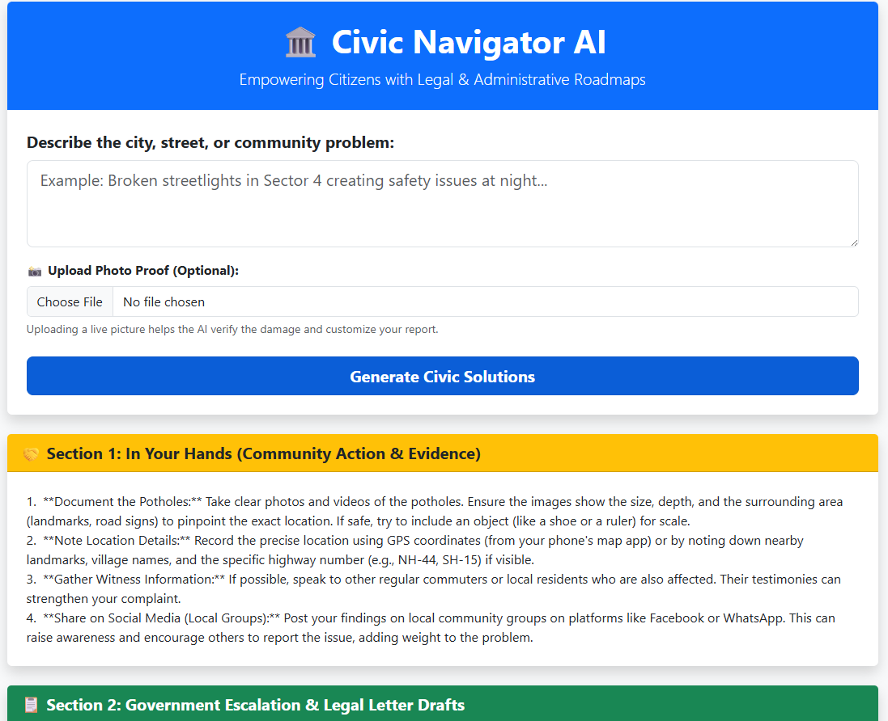
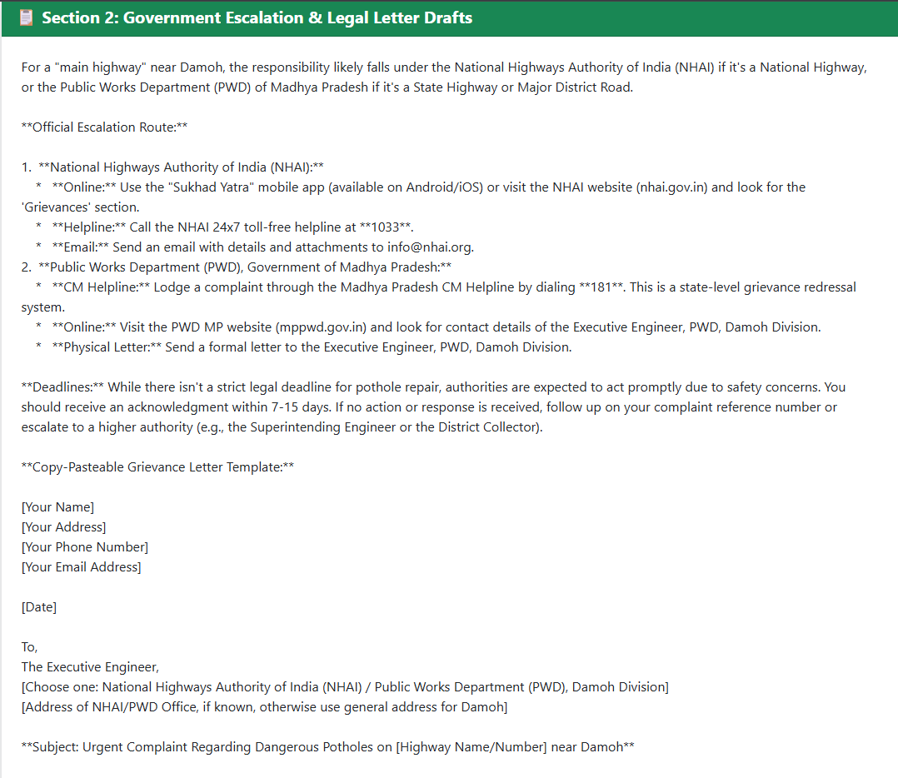
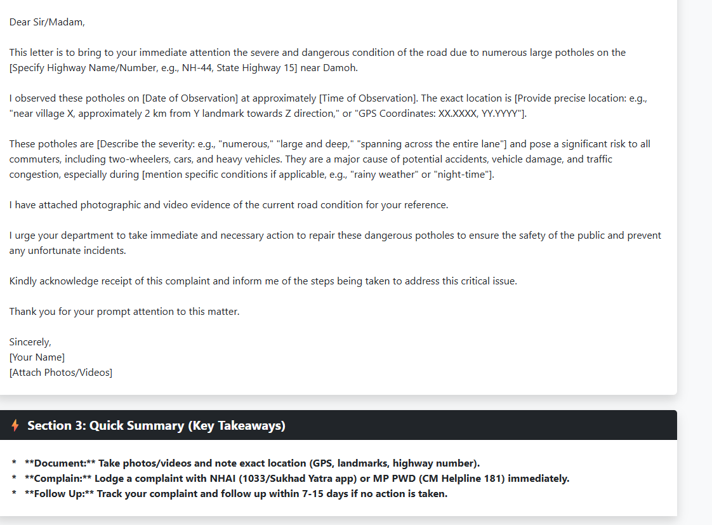

```markdown
# 🏛️ Civic AI (Civic Navigator AI)

> **Build in APAC. Build for the world.**  
> An intelligent full-stack governance roadmap generator developed for the **Gen AI Academy APAC Edition** hackathon.

---

## 📝 Project Overview

**Civic AI** bridges the gap between frustrated citizens and complex administrative bureaucracies by transforming raw, informal community complaints into legally precise, actionable escalation roadmaps. 

When citizens encounter hazardous public infrastructure—such as severe potholes, failing grids, or damaged community assets—they face fragmented institutional boundaries. Responsibilities split unpredictably between national bodies like the **National Highways Authority of India (NHAI)**, **State Public Works Departments (PWDs)**, and **local municipal corporations**. 

Civic AI shifts the burden of regulatory routing and legal formatting away from the citizen. Using a multimodal intelligence layer, it automatically maps issues to the correct jurisdictional entity, drafts formal grievance correspondence, and surfaces vital community next steps.

---

## ✨ Core Features

*   **Contextual Jurisdiction Routing:** Automatically parses location cues and environmental context from raw user text (e.g., mapping a report "near Damoh") to route complaints directly to the correct responsible authority (like the **NHAI** or **Madhya Pradesh PWD**).
*   **Dynamic Legal Draft Engine:** Instantly translates unstructured complaints into high-quality, copy-pasteable formal grievance letters matching standard regional administrative formats.
*   **Evidence Gathering Framework:** Generates situational checklists (e.g., documenting pothole depth, referencing visible landmarks, and appending precise GPS coordinates) to ensure submissions meet bureaucratic requirements.
*   **Quick Takeaway Action Guides:** Summarizes essential helplines (such as the NHAI 24x7 toll-free line `1033` or CM Helpline `181`) and outlines standard statutory resolution timelines (7-15 days).

---

## 🛠️ Technical Stack & Architecture

### Frontend
*   **HTML5, CSS3, Bootstrap:** For a clean, mobile-first, and highly responsive user workspace.
*   **Component-Driven Layout:** Color-coded alert containers optimized for rapid visual hierarchy and citizen scannability.

### Backend & AI
*   **Python Server Runtime:** Handles asynchronous communication, multimodal image data packaging, and output parsing.
*   **Gemini API:** Serves as the core generative reasoning engine, executing advanced semantic understanding, regulatory intent mapping, and contextual document synthesis.

### Cloud Infrastructure
*   **Google Cloud Run:** Hosts the serverless container configuration, offering automatic horizontal scaling to seamlessly handle widespread community reporting spikes while maintaining zero idle costs.

---

## 🔄 System Flow Diagram


```

[ Citizen Input ] ──(Text Description & Photo Proof)──► [ Google Cloud Run Backend ]
│
▼
[ Gemini API Engine ]
│
┌─────────────────────┴─────────────────────┐
▼                                           ▼
[ Jurisdiction Routing ]                    [ Legal Draft Engine ]
(Maps to precise NHAI / PWD node)           (Synthesizes ready-to-send templates)
│                                           │
└─────────────────────┬─────────────────────┘
▼
[ Dynamic Blueprint Output ]
(Action Steps, Draft Letters, Summaries)

```

---

## 📸 Prototype Snapshots

The application workspace layout structures responses into three functional blocks:

1.  **Section 1: In Your Hands (Community Action & Evidence):** Highlights yellow-coded contextual task lists helping users anchor verifiable situational metrics and cross-reference nearby village landmarks or highway numbers.
2.  **Section 2: Government Escalation & Legal Letter Drafts:** Displays a green-coded workspace housing calculated operational routes, official helpline access numbers, and the boilerplate legal letter structure containing variable field tags.
3.  **Section 3: Quick Summary (Key Takeaways):** Features a high-contrast dark neutral horizontal block indexing critical baseline procedures, immediate hotlines, and standard follow-up timelines.

### Live Interface Previews
| **Main Dashboard & Reporting Interface** | **Grievance Generation Engine** |
|---|---|
|  |  |

| **Quick Actions & Summaries** |
|---|
|  |

---

## 🚀 Getting Started Locally

### Prerequisites
*   Python 3.10+
*   Google Cloud Platform Account (with Vertex AI / Gemini API Access enabled)

### Installation
1. Clone the repository:
   ```bash
   git clone [https://github.com/your-username/civic-ai.git](https://github.com/your-username/civic-ai.git)
   cd civic-ai

```

2. Install dependencies:
```bash
pip install -r requirements.txt

```


3. Configure environment variables in a local `.env` file:
```env
GEMINI_API_KEY="your_api_key_here"
PORT=8080

```


4. Launch the local development server:
```bash
python app.py

```


```

```
